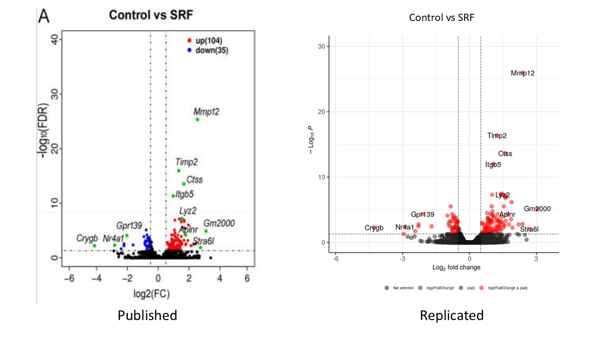

I have replicated RNA-Seq results from a paper published by Caijiao Yi, et al. in Journal of Neuroinflammation in 2022 using the DeSeq2 pipeline.

 Yi, C., Liu, J., Deng, W., Luo, C., Qi, J., Chen, M., & Xu, H. (2022). Macrophage elastase (MMP12) critically contributes to the development of subretinal fibrosis. Journal of neuroinflammation, 19(1), 78. https://doi.org/10.1186/s12974-022-02433-x
 
